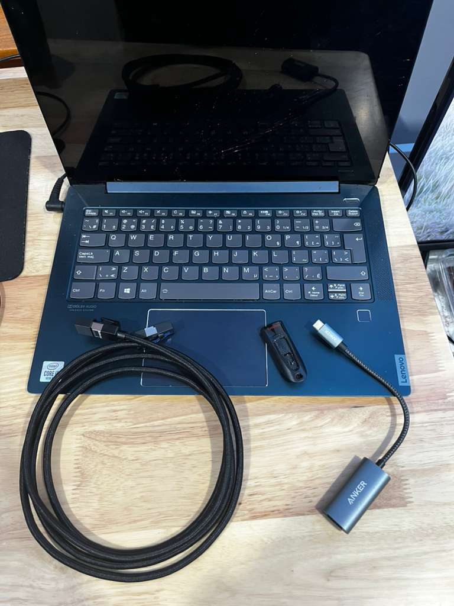
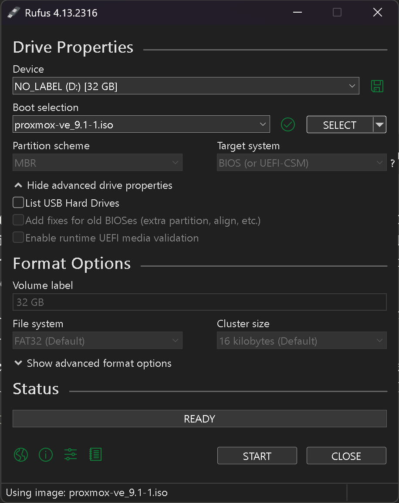
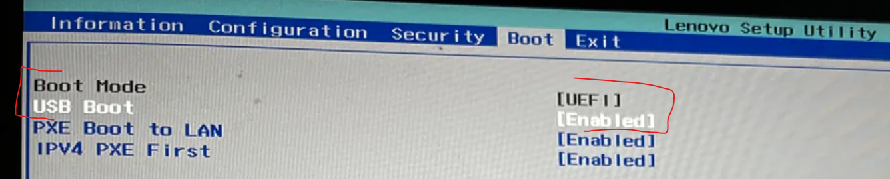
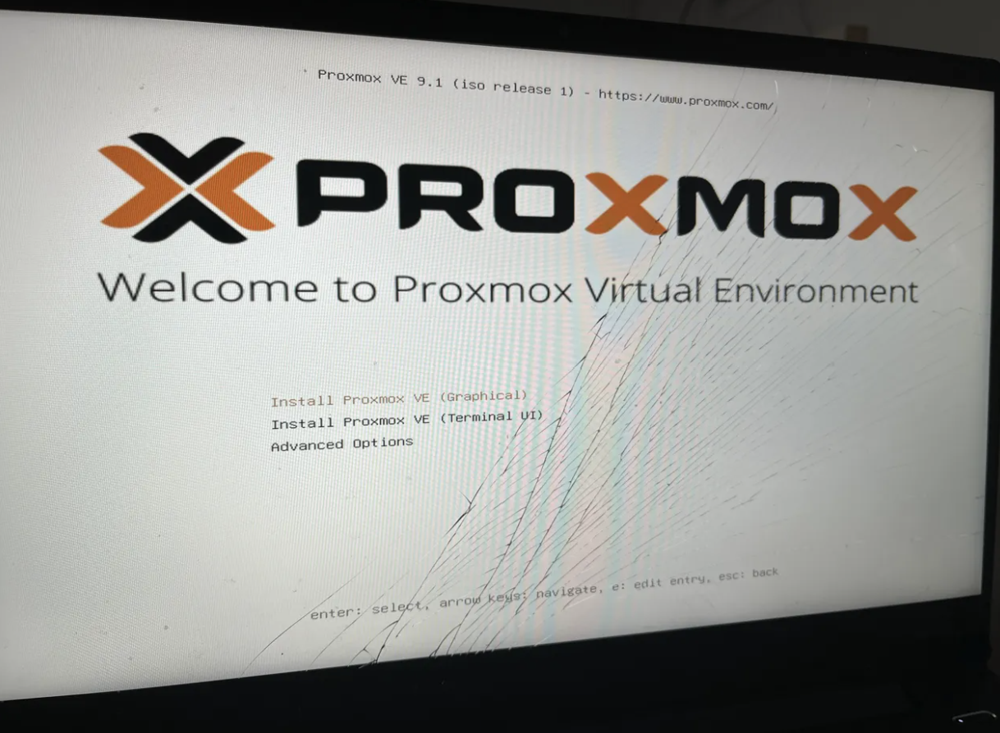
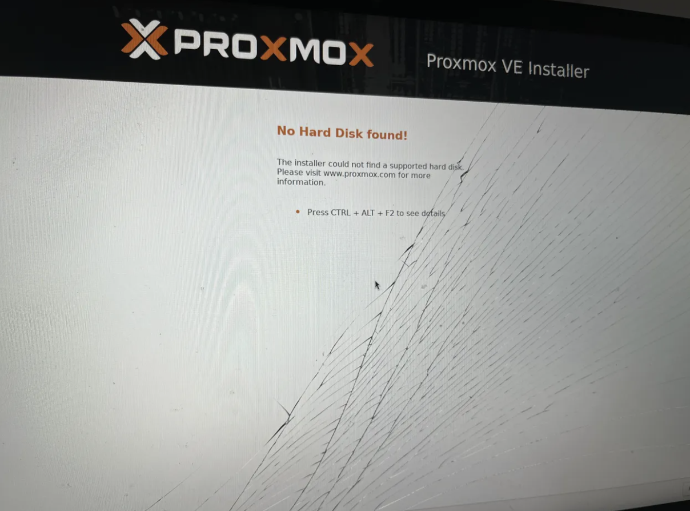
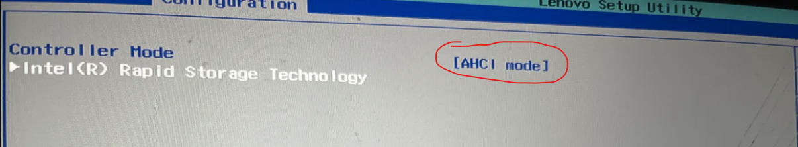
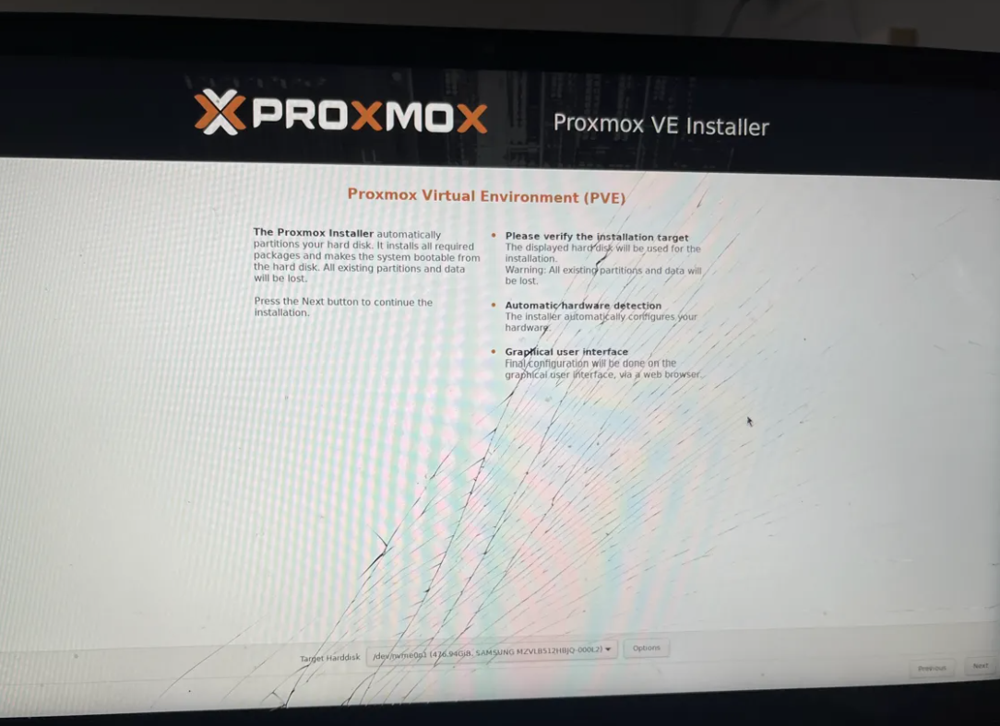
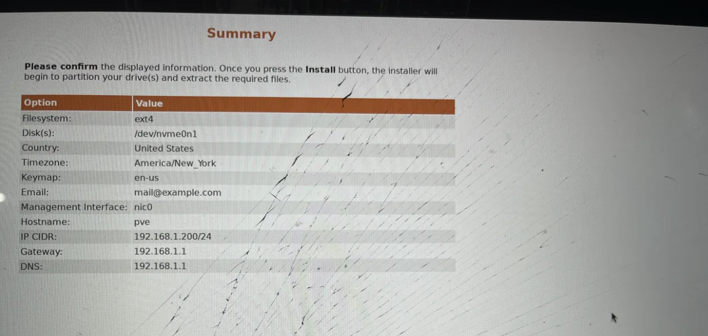
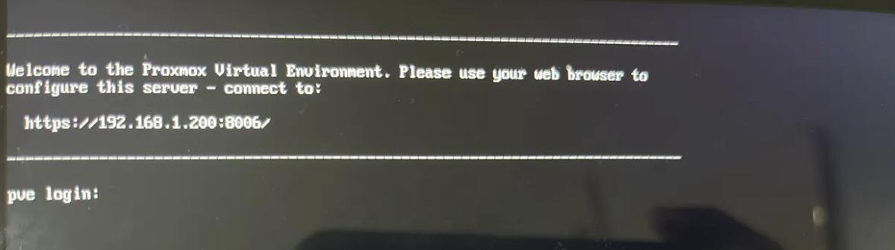
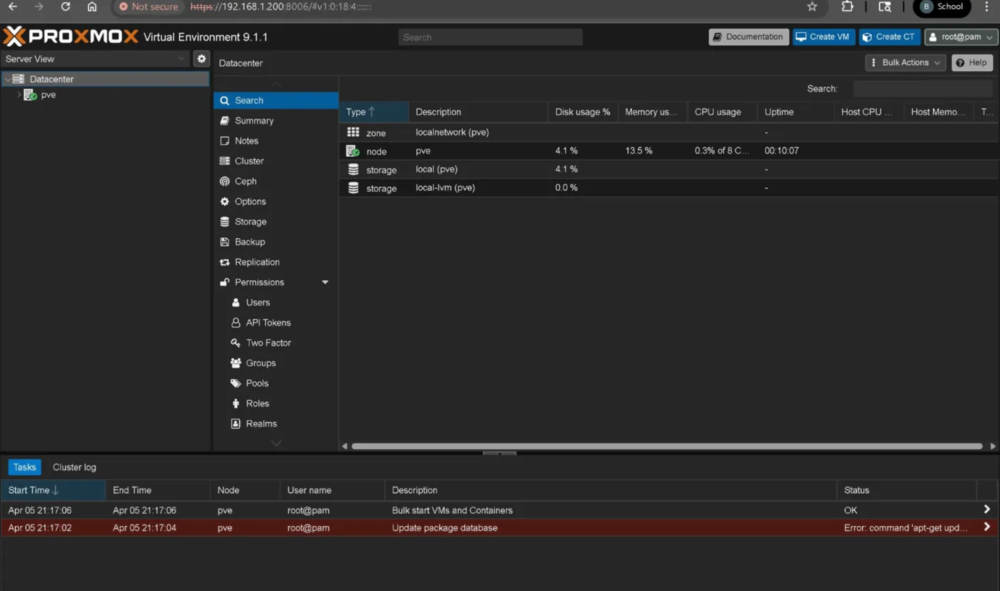

# Proxmox VE 9.1 — Installation on Lenovo IdeaPad S540

Bare-metal installation of Proxmox VE 9.1 on a repurposed Lenovo IdeaPad S540 laptop, turning it into a dedicated homelab hypervisor.

---

## Hardware

| Component | Detail |
|-----------|--------|
| **Laptop** | Lenovo IdeaPad S540-14IML Touch |
| **CPU** | Intel Core i5-10210U (4C/8T @ 1.60 GHz) |
| **RAM** | 12 GB DDR4 |
| **Storage** | Samsung MZVLB512HBJQ-000L2 — 512 GB NVMe SSD |
| **Network** | Anker USB-C to Ethernet Adapter + UGreen Cat8 Ethernet Cable |
| **Installer** | SanDisk 32 GB USB Drive |

---

## Step 1 — Create Bootable USB

Downloaded the Proxmox VE 9.1 ISO from [proxmox.com](https://www.proxmox.com/en/downloads) and flashed it to the SanDisk USB using [Rufus](https://rufus.ie).

Rufus detected the ISO as an ISOHybrid image and enforced **DD image writing mode**, which is the recommended method for Proxmox.

After flashing, Rufus confirmed GPT partition scheme with UEFI target system.

[📎 DD mode enforced notification](screenshots/ISOHybrid-detected-DD-image-writing-mode-enforced.png) · [📎 Rufus completed](screenshots/Rufus-done-writing-and-showes-partitionGPT-and-UEFI-target-system.png)

---

## Step 2 — BIOS/Firmware Configuration

Entered the Lenovo BIOS (via Windows Advanced Startup → UEFI Firmware Settings) and verified the following:

| Setting | Value | Why |
|---------|-------|-----|
| **Boot Mode** | UEFI | Proxmox requires UEFI boot |
| **USB Boot** | Enabled | Allows booting from the installer USB |
| **Intel Virtual Technology (VT-x)** | Enabled | Required for hardware-accelerated VMs |
| **Secure Boot** | Disabled | Proxmox bootloader is not signed for Secure Boot |

[📎 Intel VT-x enabled](screenshots/firmware-settings-show-Intel-Virtual-Technology-enabled.png) · [📎 Secure Boot disabled](screenshots/firmware-settings-show-Secure-Boot-disabled.png)

---

## Step 3 — Boot from USB

Selected the USB drive from the Boot Manager. Proxmox USB appeared as **"Linpus Lite (USB)"** — this is normal and just how the BIOS labels the Proxmox ISO's bootloader.

[📎 Boot Manager showing USB](screenshots/proxmox-boot-USB-shown-as-Linpus-Lite-in-BootManager.png)

The Proxmox VE 9.1 installer loaded successfully.

---

## Troubleshoot — "No Hard Disk Found"

The installer initially could not detect the NVMe SSD.

**Root cause:** The BIOS storage controller was set to **Intel RST (Rapid Storage Technology)** mode. The Proxmox Linux kernel cannot see NVMe drives through the RST/RAID driver.

**Fix:** Changed the controller mode from **RST** → **AHCI** in BIOS under Configuration → Storage.

| Before | After |
|--------|-------|
|  |  |

After switching to AHCI, the installer detected the Samsung NVMe SSD (476.94 GiB).

> **Note:** Changing from RST to AHCI makes the existing Windows installation unbootable. This was expected since the drive was being wiped for Proxmox.

---

## Step 4 — Install Proxmox VE

Selected **"Install Proxmox VE (Graphical)"** and configured the following:

| Setting | Value |
|---------|-------|
| **Filesystem** | ext4 |
| **Target Disk** | /dev/nvme0n1 (476.94 GiB) |
| **Country** | United States |
| **Timezone** | America/New_York |
| **Keyboard** | en-us |
| **Hostname** | pve |
| **IP Address** | 192.168.1.200/24 |
| **Gateway** | 192.168.1.1 |
| **DNS** | 192.168.1.1 |

**Why ext4?** With a single NVMe disk and 12 GB RAM, ext4 is the best choice — low overhead, stable, no wasted RAM. ZFS is better suited for multi-disk setups with 32+ GB RAM. 

Installation completed and the server rebooted into Proxmox.

---

## Step 5 — Access Web UI

From the Surface Pro on the same network, opened a browser and navigated to `https://192.168.1.200:8006`. Logged in as `root` with PAM authentication.

The Proxmox VE web interface is live. Server management continues in [02-post-install-config](../02-post-install-config/).
