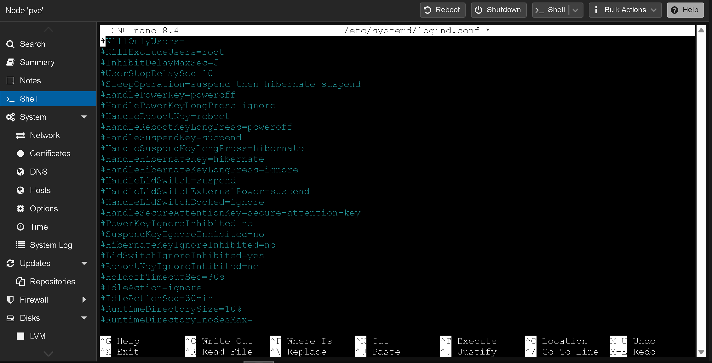
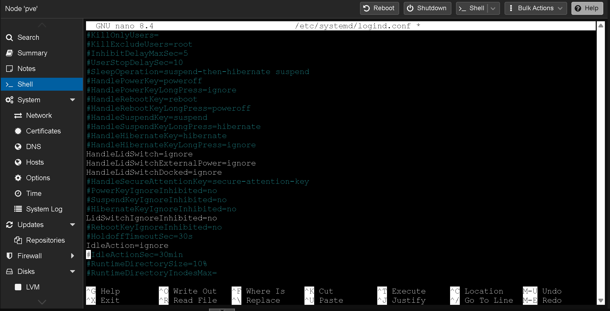
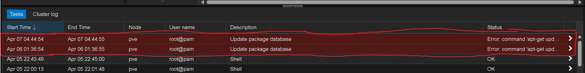
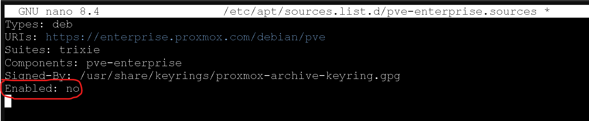
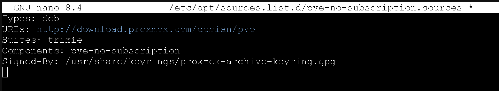
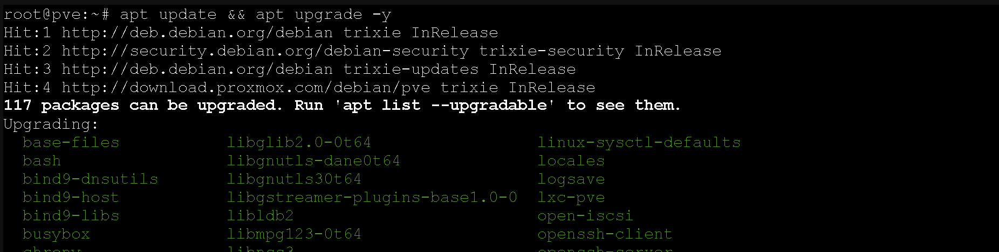

# Post-Install Configuration

After installing Proxmox VE, two essential configurations: preventing the laptop from sleeping when the lid is closed, and switching from the enterprise package repository to the free community repository.

---

## Lid Close & Idle Sleep Prevention

Since Proxmox is running on a laptop that will stay closed and tucked away, the default behavior (suspend on lid close) needs to be disabled.

Edited `/etc/systemd/logind.conf` via the Proxmox web UI Shell (`pve` → Shell):

```
nano /etc/systemd/logind.conf
```

### Before

The relevant lines are all commented out (inactive), defaulting to suspend on lid close.



### After

Uncommented and changed five settings:

| Setting | Value | Purpose |
|---------|-------|---------|
| `HandleLidSwitch` | `ignore` | Don't suspend when lid closes on battery |
| `HandleLidSwitchExternalPower` | `ignore` | Don't suspend when lid closes on AC power |
| `HandleLidSwitchDocked` | `ignore` | Don't suspend when lid closes while docked |
| `LidSwitchIgnoreInhibited` | `no` | Ensure lid settings are always respected |
| `IdleAction` | `ignore` | Don't suspend after idle timeout |



Applied the changes:

```
systemctl restart systemd-logind
```

[📎 Restart command output](screenshots/restarting-systemd-logind-after-editing-logind.conf.png)

**Verified** by closing the laptop lid and confirming the Proxmox web UI remained accessible from the Surface Pro. The screen turns off but the server keeps running — exactly what we want for headless operation.

---

## Fix Enterprise Repository Error

On first boot, `apt update` fails because Proxmox is configured to use the **enterprise repository**, which requires a paid subscription.

**The error:** `401 Unauthorized` when trying to fetch from `enterprise.proxmox.com`.



### Step 1 — Disable the Enterprise Repos

Proxmox 9 uses the `.sources` (DEB822) format. Two enterprise repos need to be disabled: **PVE** and **Ceph**.

Opened `/etc/apt/sources.list.d/pve-enterprise.sources` and added `Enabled: no`:

[📎 Enterprise file before fix](screenshots/proxmox-error-pve-enterprise-sources-file-before-fixing.png)



Did the same for `/etc/apt/sources.list.d/ceph.sources`:

[📎 Ceph file with Enabled: no](screenshots/proxmox-error-also-added-Enabled-no-to-the-ceph-sources-file.png)

### Step 2 — Add the Community Repository

Created a new file `/etc/apt/sources.list.d/pve-no-subscription.sources`:

```
Types: deb
URIs: http://download.proxmox.com/debian/pve
Suites: trixie
Components: pve-no-subscription
Signed-By: /usr/share/keyrings/proxmox-archive-keyring.gpg
```



### Step 3 — Update

```
apt update && apt upgrade -y
```

Packages now pull from the community repo without errors.



> **Note:** The community repo contains the same packages as the enterprise repo. The only difference is the enterprise repo receives slightly more testing and is intended for production environments with paid support. For a homelab, the community repo is standard practice.

---

Configuration continues in [03-tailscale](../03-tailscale/).
