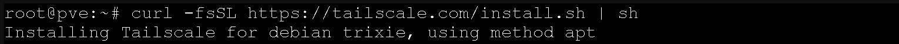
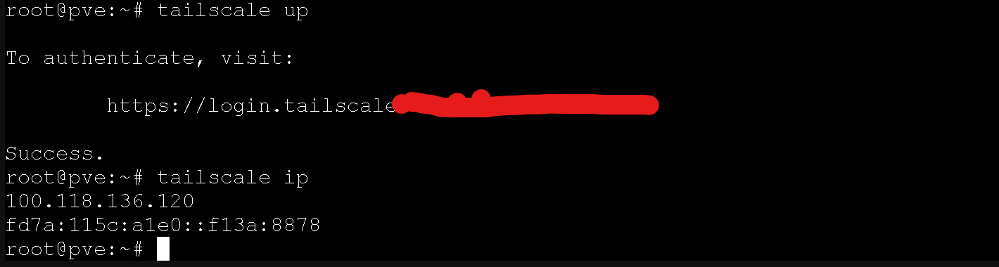
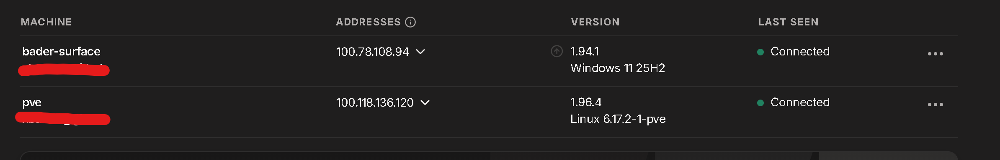
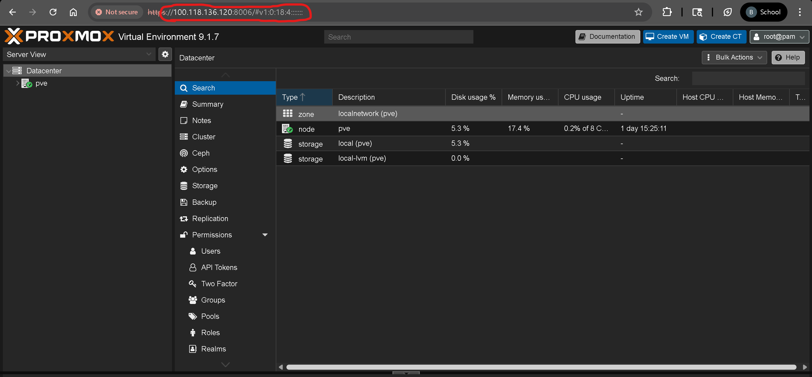

# Tailscale — Remote Access to Proxmox

Installed Tailscale directly on the Proxmox host to enable secure remote access to the server and web UI from anywhere, any network.

---

## Why Tailscale?

The Proxmox web UI at `192.168.1.200:8006` is only reachable from the home network. Tailscale creates an encrypted mesh VPN between devices using WireGuard, allowing access from any internet connection without exposing ports or configuring the router.

**Why directly on Proxmox (not in an LXC)?** Installing on the host gives remote access to everything — the web UI, SSH, and all VMs — through a single installation. An LXC would only expose that container's network without extra routing configuration.

---

## Step 1 — Install Tailscale

From the Proxmox web UI Shell (`pve` → Shell):

```
curl -fsSL https://tailscale.com/install.sh | sh
```



---

## Step 2 — Authenticate

Started Tailscale and authenticated via the provided login URL:

```
tailscale up
```

After authenticating in the browser, the CLI confirmed success and `tailscale ip` returned the assigned Tailscale IP.



| Device | Tailscale IP |
|--------|-------------|
| **pve** (Proxmox server) | `100.118.136.120` |
| **bader-surface** (Surface Pro 9) | `100.78.108.94` |

Tailscale dashboard showing both machines connected:



---

## Step 3 — Enable on Boot

Ensured Tailscale starts automatically after a reboot so remote access is always available:

```
systemctl enable tailscaled
systemctl status tailscaled
```

[📎 Enable and verify output](screenshots/to-start-tailscale-on-boot-running-systemctl-enable-tailscaled-and-verify-status.png)

---

## Step 4 — Verify Remote Access

Accessed the Proxmox web UI from the Surface Pro using the Tailscale IP:

```
https://100.118.136.120:8006
```



The server is now reachable from any network. As long as the device has Tailscale running and is authenticated to the tailnet, it can reach Proxmox.

> **Note:** Tailscale IPs (`100.x.x.x`) are only routable within your personal tailnet. They are not public and cannot be reached by anyone outside your Tailscale account — safe to document.

---

## What's Next

Tailscale also supports subnet routing (access entire home network remotely), exit nodes (route all traffic through home), MagicDNS (reach `pve` by name instead of IP), and Tailscale SSH. These may be explored in future updates.

---

Server setup complete. Next: [04-windows10-vm](../04-windows10-vm/).
