# Internal Lab Network (vmbr1)

Creating a second Linux bridge on the Proxmox host to provide a private, isolated network for lab VMs — separate from the home network, with consistent static IPs regardless of external network changes.

---

## Overview

By default, all VMs share `vmbr0` which bridges to the physical home network. This works, but lab traffic (attacks, scans, agent communication) flows across the same network as personal devices.

`vmbr1` is a second bridge with **no physical interface attached** — traffic stays internal between VMs only. Each VM gets two NICs: `vmbr0` for internet access, `vmbr1` for internal lab communication.

| Bridge | Purpose | Physical Interface |
|--------|---------|-------------------|
| `vmbr0` | Internet access, home network | `nic0` (Ethernet adapter) |
| `vmbr1` | Internal lab network only | None — isolated |

**IP scheme:**

| Host | Internal IP |
|------|------------|
| Proxmox host | `10.10.10.1` |
| Ubuntu Server | `10.10.10.20` |
| Windows 10 RDP | `10.10.10.40` |

---

## Step 1 — Create vmbr1 on Proxmox

Navigated to `pve` → System → Network → Create → Linux Bridge.

Configured the bridge with no bridge ports — this is what makes it internal-only:

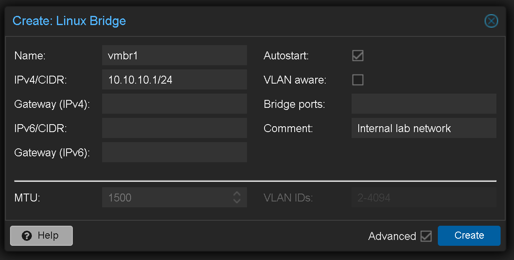

Clicked **Apply Configuration** to activate without rebooting.

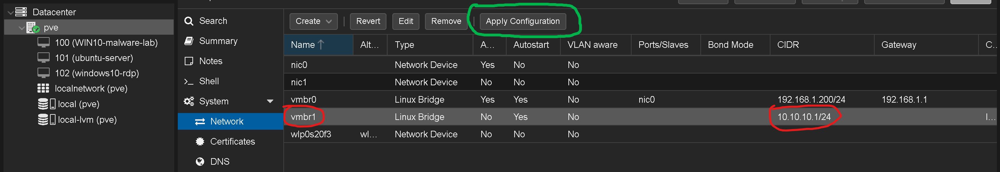

---

## Step 2 — Add Second NIC to Each VM

For each VM, went to Hardware → Add → Network Device and selected `vmbr1`.

- **Ubuntu Server:** VirtIO model (Linux has native VirtIO drivers)
- **Windows 10 RDP:** Intel E1000 model (Windows requires E1000 for out-of-box compatibility)

[📎 Adding vmbr1 to Ubuntu VM](screenshots/add-network-device-vmbr1-for-ubuntu-vm-with-VirtIO-model.png) · [📎 Adding vmbr1 to Windows VM](screenshots/add-network-device-vmbr1-for-windows10-vm-with-Intel-E1000-model.png)

---

## Step 3 — Configure Static IP on Ubuntu Server

The new interface `ens19` appeared with no IP after adding the NIC.

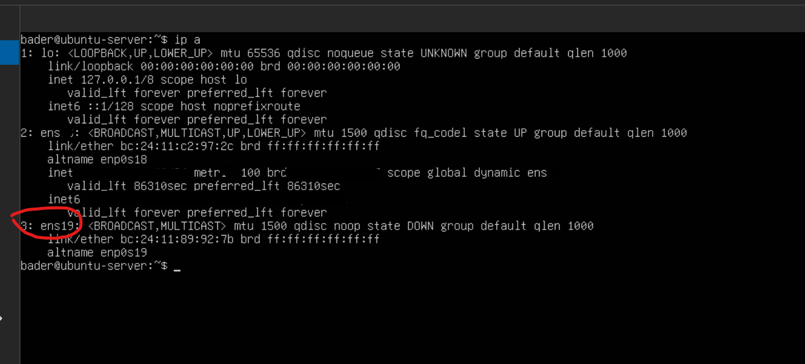

Removed cloud-init to prevent it from regenerating network config on reboot, then created a clean Netplan config covering both interfaces:

```yaml
network:
  version: 2
  ethernets:
    ens18:
      dhcp4: true
    ens19:
      dhcp4: false
      addresses:
        - 10.10.10.20/24
      optional: true
```

`optional: true` on `ens19` prevents a 2-3 minute boot delay that occurs when a NIC has no gateway — without it, the system waits for network availability on that interface before completing boot.

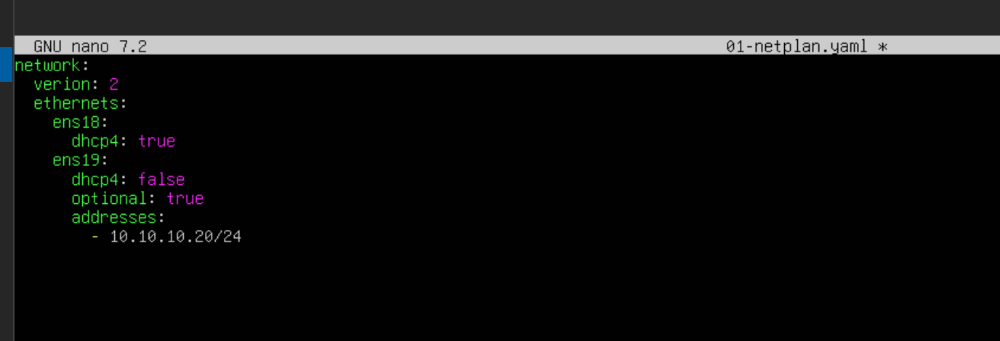

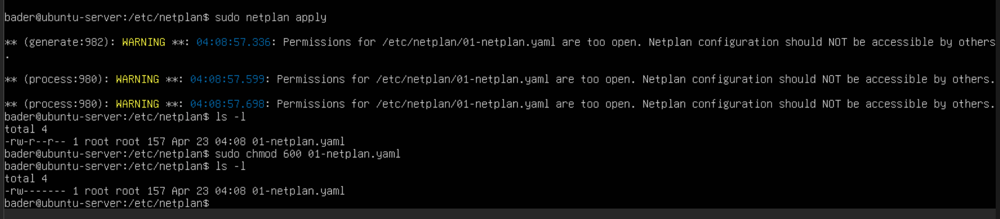

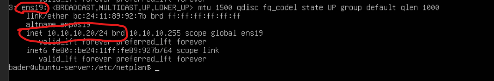

---

## Step 4 — Configure Static IP on Windows 10

Navigated to Settings → Network & Internet → Change adapter options. The new adapter appeared as "Ethernet 2 — Unidentified network."

[📎 Locating Change adapter options](screenshots/windows-advanced-net-settings-shows-change-adapter-options-choice.png)

Set a static IP on Ethernet 2 via IPv4 Properties — no gateway or DNS since this interface is for internal communication only:

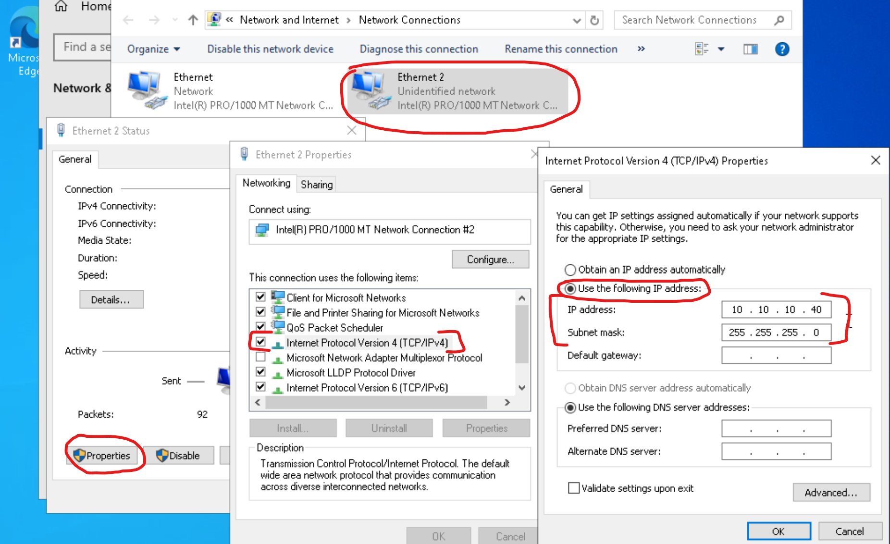

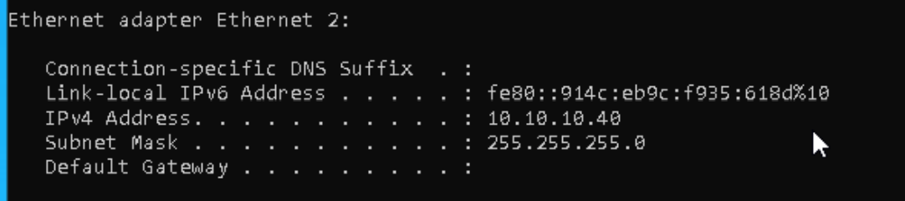

---

## Step 5 — Verify Connectivity

**Windows → Ubuntu ping** confirmed immediately since Ubuntu accepts ICMP by default.

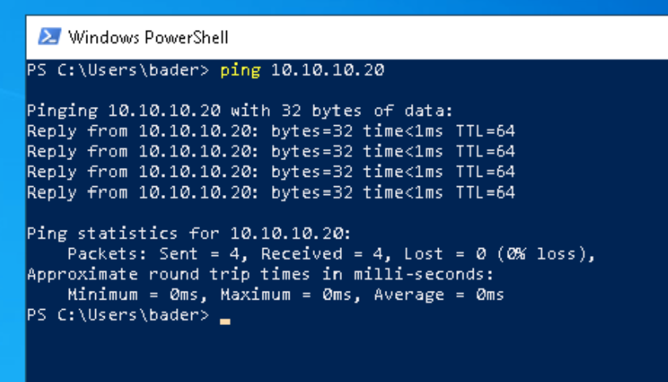

**Ubuntu → Windows ping** required a custom Windows Firewall inbound rule — Windows blocks ICMP by default. Created a Custom ICMPv4 rule scoped to `10.10.10.0/24` only.

[📎 Creating custom inbound rule](screenshots/windows-shows-choosing-inbound-newrule-ruletype-custom.png) · [📎 Scope set to internal subnet](screenshots/windows-scope-to-internal-network-subnet.png)

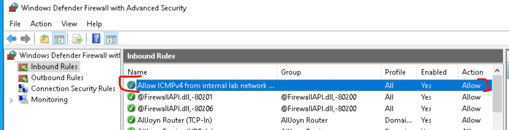

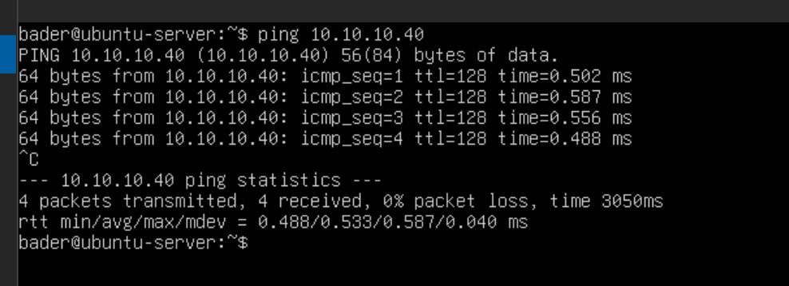

Both VMs can communicate over the internal network. Internet access remains functional through `vmbr0` on each VM.

---

> A dedicated virtual firewall/router (pfSense or OPNsense) will be added in a future section to replace this simple bridge with proper network segmentation, firewall rules, and traffic inspection between subnets.
