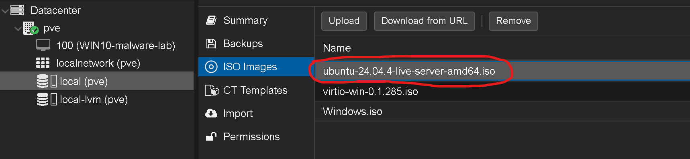
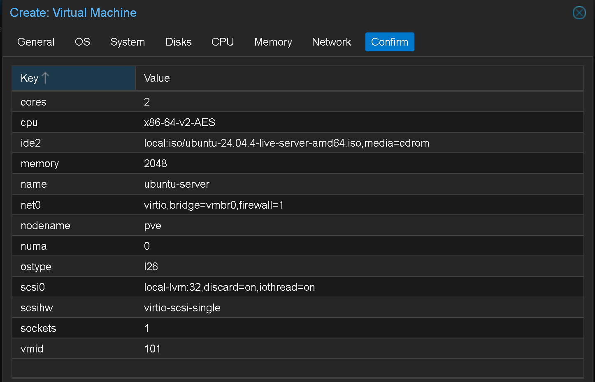
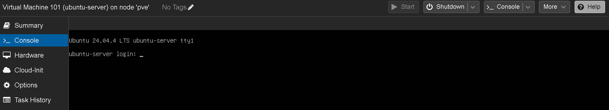

# Ubuntu Server VM

Creating an Ubuntu Server 24.04 LTS virtual machine on Proxmox to serve as the base environment for security labs (SSH detection, Wazuh agent, network analysis).

For a detailed walkthrough of VM creation in Proxmox, see [windows10-vm](../windows10-vm/).

---

## ISO Upload

Downloaded Ubuntu Server 24.04.4 LTS and uploaded it to Proxmox via `local (pve)` → ISO Images → Upload.

---

## VM Configuration

| Setting | Value | Difference from Windows VM |
|---------|-------|---------------------------|
| **VM ID** | 101 | — |
| **Name** | ubuntu-server | — |
| **OS Type** | Linux (6.x - 2.6 Kernel) | Windows → Linux |
| **Disk** | SCSI, 32 GiB, Discard on | 60 GiB → 32 GiB (no GUI, smaller footprint) |
| **CPU** | 2 cores | — |
| **Memory** | 2048 MiB | 4.5 GiB → 2 GiB (headless server needs less) |
| **Network** | VirtIO (paravirtualized) | E1000 → VirtIO (Linux has built-in VirtIO drivers, no extra setup needed — better performance) |
| **SCSI Driver** | Works out of the box | No VirtIO driver workaround needed — Linux kernel includes VirtIO SCSI drivers natively |

---

## Result

Ubuntu Server installed with OpenSSH enabled and network access confirmed via DHCP on the bridged network.

