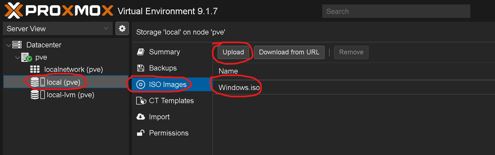
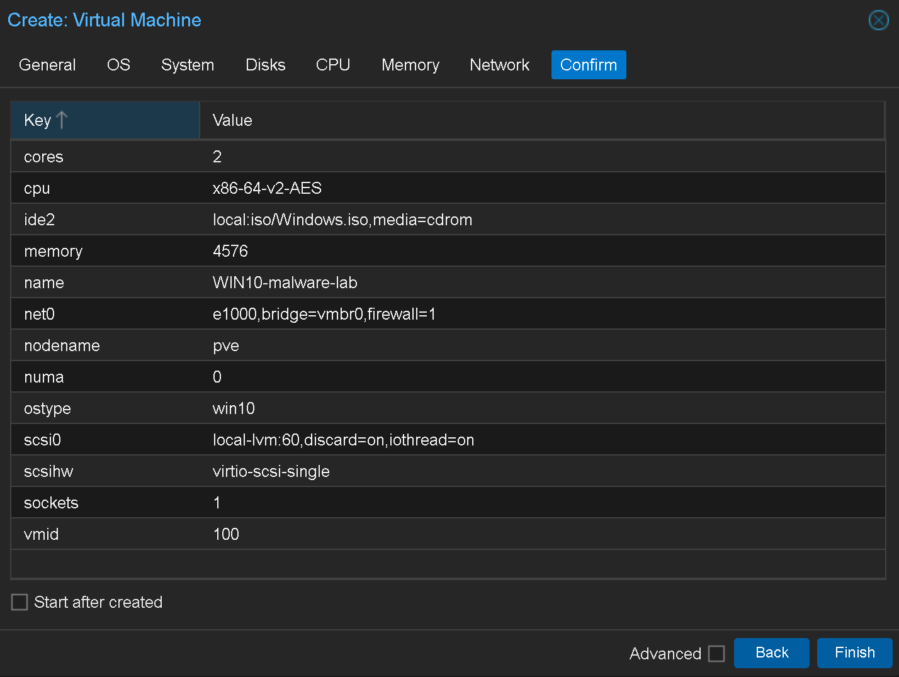
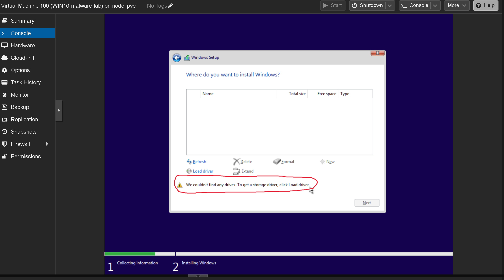
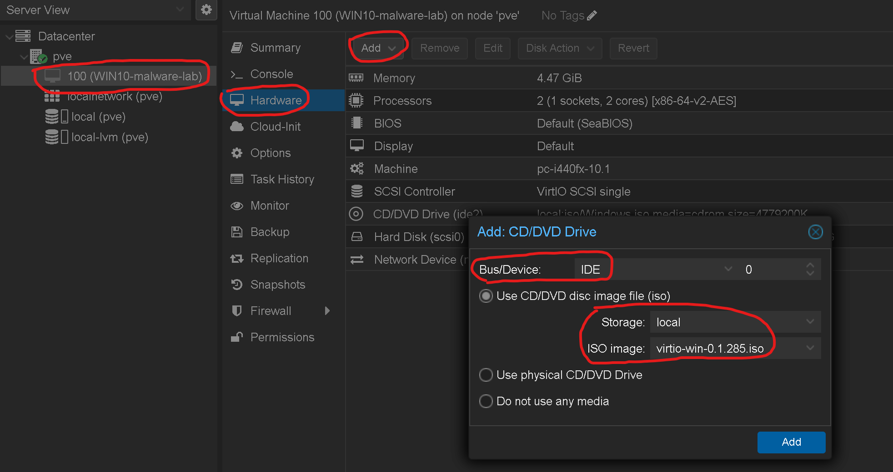
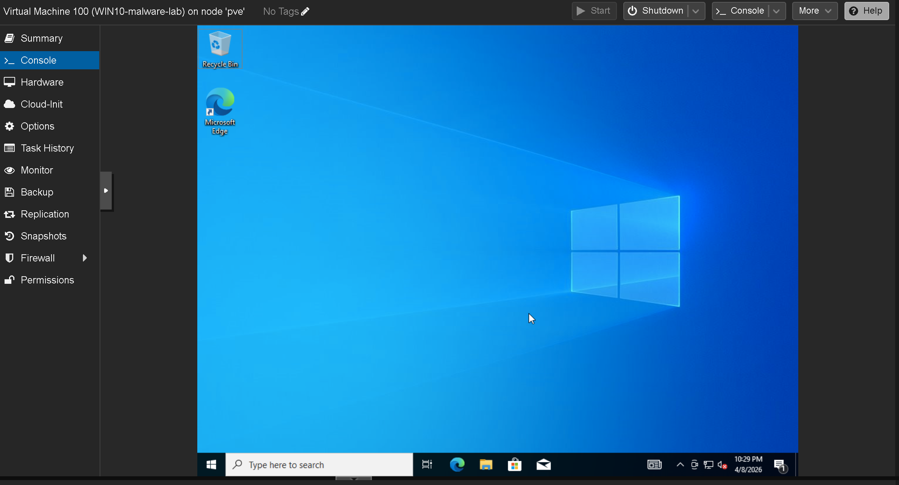

# Windows 10 VM

Creating a Windows 10 Pro virtual machine on Proxmox — from ISO upload to working desktop with network access.

---

## Step 1 — Upload Windows 10 ISO

Uploaded the Windows 10 ISO to Proxmox via `local (pve)` → ISO Images → Upload.

---

## Step 2 — Create the VM

Clicked **Create VM** in the Proxmox web UI and configured the following:

| Setting | Value | Why |
|---------|-------|-----|
| **VM ID** | 100 | Auto-assigned, first VM on this server |
| **Name** | WIN10-malware-lab | Descriptive name for identification |
| **OS Type** | Microsoft Windows 10/2016/2019 | Tells Proxmox to apply Windows-specific optimizations |
| **BIOS** | SeaBIOS | Standard BIOS — OVMF/UEFI only needed for Windows 11 |
| **Machine** | i440fx | Default chipset, fully compatible — q35 only needed for PCIe passthrough |
| **SCSI Controller** | VirtIO SCSI single | Best performing disk controller for Proxmox VMs |
| **Disk Bus** | SCSI | Matches the VirtIO SCSI controller for optimal disk I/O |
| **Disk Size** | 60 GiB | Comfortable space for Windows + tools — stored on `local-lvm` (373 GB available) |
| **Discard** | On | Enables TRIM — lets the SSD reclaim space when files are deleted inside the VM |
| **CPU Cores** | 2 | Balanced — enough for a responsive Windows experience, leaves cores for the host |
| **Memory** | 4.5 GiB | Windows 10 needs at least 4 GB to run smoothly — leaves ~7.5 GB for Proxmox |
| **Network Model** | Intel E1000 | Windows has built-in drivers — works immediately without extra setup |
| **Network Bridge** | vmbr0 | Bridges to the physical network — VM gets an IP from the router with full internet access |

---

## Troubleshoot — Windows Can't Find the Virtual Hard Drive

During Windows setup, the installer couldn't detect the 60 GB disk.

**Root cause:** Windows doesn't include drivers for the VirtIO SCSI disk controller out of the box. The virtual disk exists but Windows can't see it without the right driver.

**Fix:**

1. Downloaded the [VirtIO drivers ISO](https://fedorapeople.org/groups/virt/virtio-win/direct-downloads/stable-virtio/virtio-win.iso) and uploaded it to Proxmox ISO storage

[📎 VirtIO ISO uploaded](screenshots/troubleshoot-uploaded-virtio-driver-iso-to-local-iso-images.png)

2. Shut down the VM, added the VirtIO ISO as a second CD/DVD drive via Hardware → Add → CD/DVD Drive (set to **IDE** — since the SCSI driver is what's missing, the driver disc itself must use IDE to be readable)

3. Started the VM, clicked **Load driver** in Windows setup, and selected the `w10` driver: `Red Hat VirtIO SCSI pass-through controller (D:\amd64\w10\vioscsi.inf)`

[📎 Selecting the W10 VirtIO SCSI driver](screenshots/troubleshoot-fixed-windows-vm-detected-the-hard-drive-choosing-w10-version.png)

4. The 60 GB disk appeared and installation continued normally

[📎 Disk detected after driver load](screenshots/troubleshoot-fixed-confirmation-showing-the-hard-drive-with-60GB.png)

---

## Result

Windows 10 Pro installed and running with internet access, accessible via the Proxmox Console tab.

The VM is ready to be used as a base for projects. Further configuration specific to individual use cases (malware analysis tooling, snapshots, network isolation) will be documented in their respective project repos.
